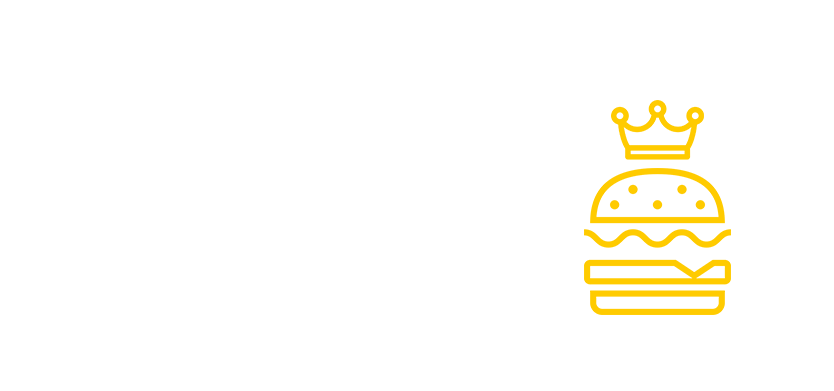
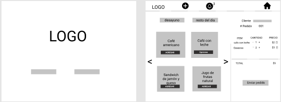
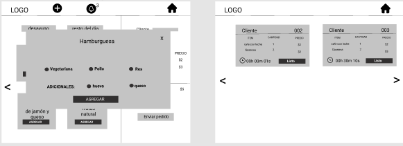
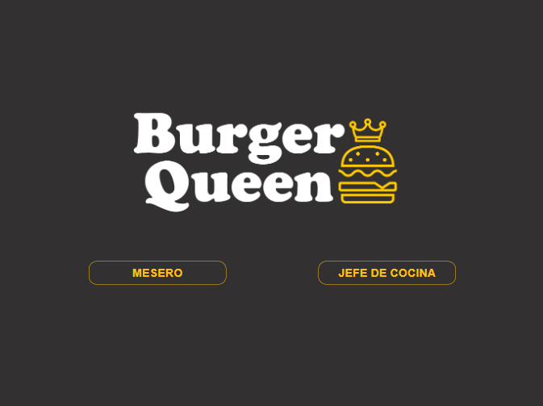
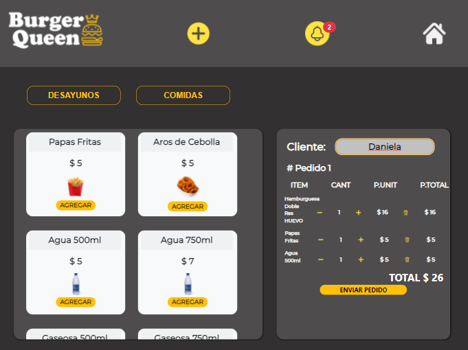
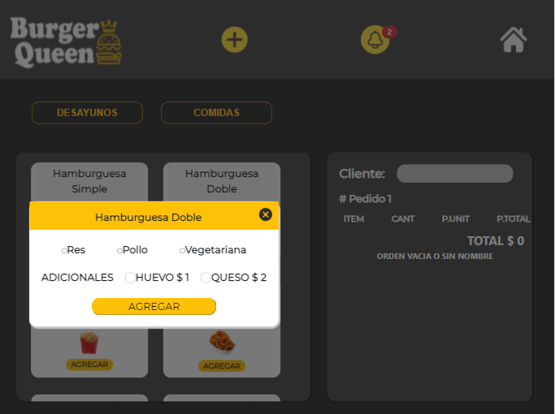
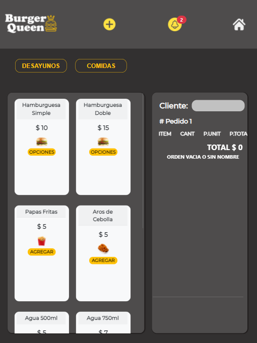
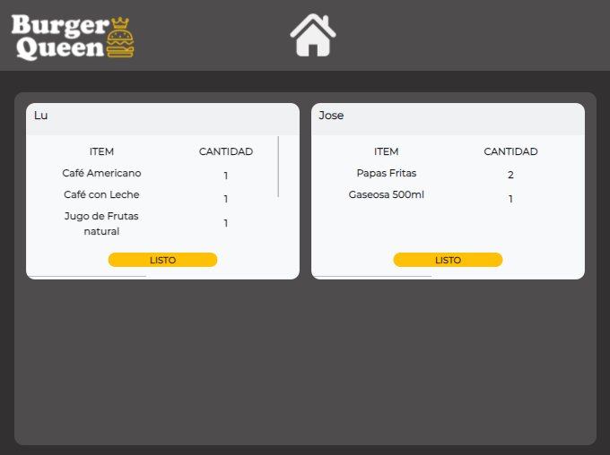
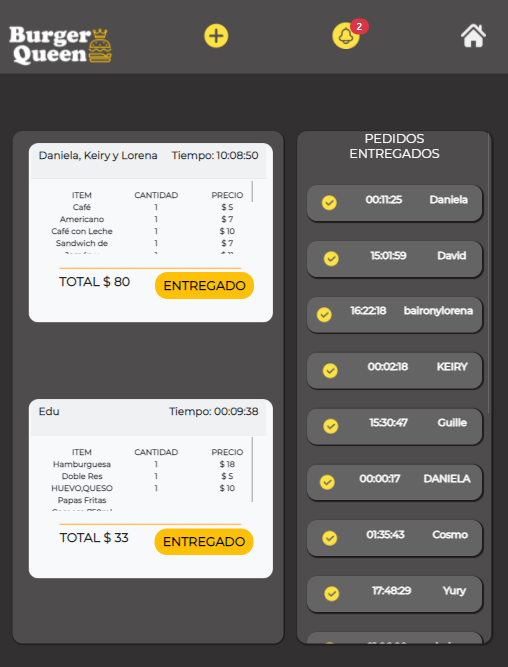
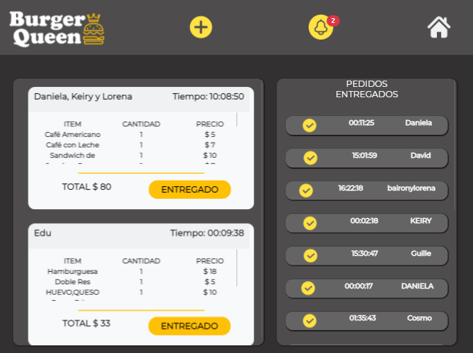

# Burger Queen

## https://bq-react-web.herokuapp.com/

## Realizado por Daniela Funes, Keiry Quero y Lorena Marroquín.

### [Índice](#índice)
  - [1. Resumen del proyecto](#1-resumen-del-proyecto)
  - [2. Historias de Usuario](#2-historias-de-usuario)
  - [3. Prototipos](#3-prototipos)
  - [4. Versión Final](#4-versión-final)

***

## 1. Resumen del proyecto

Burger Queen es una PWA (progressive web application) realizada con React. Es una app para restaurante, que permitirá la toma de pedidos de clientes, el envío de pedidos a cocina y el aviso para la entrega de los mismos a los clientes.
Es una app diseñada para tablets con diseño responsive para orientación horizontal y vertical.
Esta app será utilizada por l@s mesoner@ y por el/la Chef del restaurant. Por tal razón la app puede ser accedida desde los dos perfiles según sea necesario.
A medida que l@s meser@s y el/la chef hagan uso de la misma, esta se irá actualizando en tiempo real en ambos perfiles simultáneamente.

## 2. Historias de Usuario
 1 - Yo como meserx quiero tomar el pedido de un cliente para no depender de mi mala memoria, poder informarle los precios al cliente, y enviarlo a la cocina para evitar errores y que se puedan ir preparando en orden.

 2 - Yo como jefx de cocina quiero ver los pedidos de los clientes en orden y marcar cuáles están listos para saber qué se debe cocinar y avisar a lxs meserxs que un pedido está listo para servirlo a un cliente.

 3 - Yo como meserx quiero saber que hay pedidos listos, verlos en pantalla y así poder entregarlos rápidamente.

## 3. Prototipos

 

 

## 4. Versión Final

 
 
 

